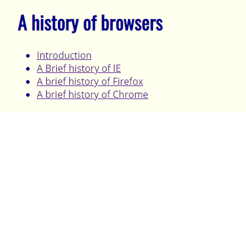
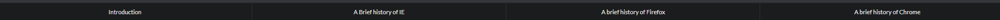

Near the beginning of the month, my ICS314 class started using html and css to make shells of webpages. These mock-ups have been very basic. They only included basic <p> (paragraph), <h> (Header), <ul> (Unordered list), and <div> (Division) to position our text and pictures across the webpage with css to position the text areas around the screen. coding this way took a while but was very precise.

Example of code:
---

```html

<h1>A history of browsers</h1>
<ul>
  <li><a href="https://docs.google.com/document/d/14qTjKdnAviPcuFimbtG37Fm42NmgrkSpW9dHoV5VK1o/edit">Introduction</a>
  </li>
  <li><a href="https://docs.google.com/document/d/1vRdcV1x-PemcMv3XRickuyeuRjXHkMxgRBBYqYBNcdA/edit">A Brief history of
    IE</a></li>
  <li><a href="https://docs.google.com/document/d/1K3j5HwVhhDmmz63QxDxUNsf3ZjM7eEPuOS-Fj2InnTA/edit">A brief history of
    Firefox</a></li>
  <li><a href="https://docs.google.com/document/d/1JFEs2_Wd8F2TsbBfhhzPALWIRTACoeOzCRtBIpRgbbs/edit">A brief history of
    Chrome</a></li>
</ul>
```
As you can see, this code is straight to the point with no semantic ui. Below is the example of what it loos like on the top part of the screen.<br/>

<br/>

Coding without a framework to guide me is definitely a very tedious process. Getting the page styled correctly required a lot of tweaking to the stylesheet.


Example of Semantic ui code:
---

```html

<h1><a name ="title">  A history of browsers</a></h1>
<div class="ui fixed top inverted four item menu">
    <a class="item" href="https://docs.google.com/document/d/14qTjKdnAviPcuFimbtG37Fm42NmgrkSpW9dHoV5VK1o/edit">Introduction</a>
    <a class="item" href="https://docs.google.com/document/d/1vRdcV1x-PemcMv3XRickuyeuRjXHkMxgRBBYqYBNcdA/edit">A Brief history of IE</a>
    <a class="item" href="https://docs.google.com/document/d/1K3j5HwVhhDmmz63QxDxUNsf3ZjM7eEPuOS-Fj2InnTA/edit">A brief history of Firefox</a>
    <a class="item" href="https://docs.google.com/document/d/1JFEs2_Wd8F2TsbBfhhzPALWIRTACoeOzCRtBIpRgbbs/edit">A brief history of Chrome</a>
</div>

```



Conclusion:
---
