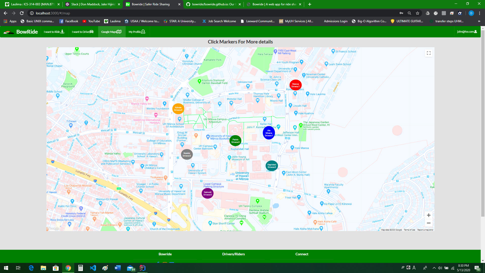

My Contribution
---

My job with this project was to implement a Google maps page to display pickup locations and driver data. I did so by using a Google maps library called Google-map-react. Bellow is an example of how i set up my program. Google maps requires a api key. You can follow the instructions and get one from [https://developers.google.com/maps/documentation/javascript/get-api-key](https://developers.google.com/maps/documentation/javascript/get-api-key)

```jsx
export default class SimpleMap extends Component{

  render() {
    return (

        <div className='ui center aligned container' style={{height: '80vh', width: '80vw'}}>
        <GoogleMapReact
            bootstrapURLKeys='API_KEY_HERE'
            defaultCenter={{lat: 21.298872, lng: -157.817204}}
            defaultZoom={ 16 }
        >
          <Marker
              lat={21.298872}
              lng={-157.817204}
              text={'Pick-Up Location'}
          />
        </GoogleMapReact>
        </div>
    );
  }

}
```

for more details on our project and to download a template to run, please visit our [Bowride Organization](https://github.com/bowride) page.
 


