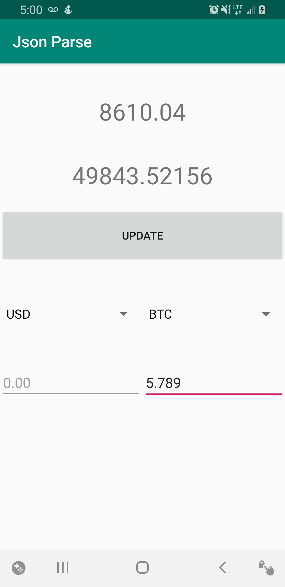

  

Crypto calculator gets data from an API called Alpha Vantage. this API has data for crypto as well as stocks. i manualy grabbed the data from the API and then use text fields and buttons to display the data and do conversions. An update to this app will implement json parsing. It uses a variety of currency types as well as coin types thats availible through the API.

[Learn more](https://www.alphavantage.co/)[Git Repository](https://github.com/derekasola/Crypto-Calculator)

