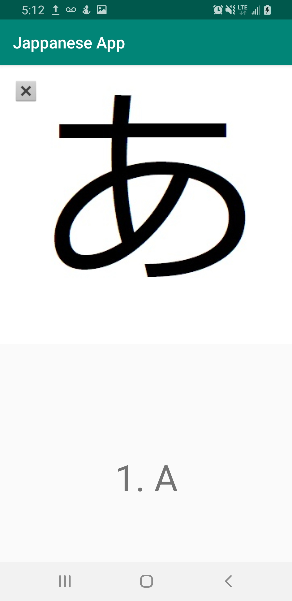

This app was begun after my first semester of japanese 101 fall 2019 durring winter break. It uses images of hiragana, katakana, and will eventally kanji to be displyed. It detects left and right swipes to control the pictures and the textView values. i plan to add words, sentences, and even pronunciation with google translate.

Example of swipe commands:
---

```java
 public void onSwipeRight() {  
                i -= 1;
                
                if (i < 0) {
                    i = 45;
                }
                
                String textView = (String) romanjiArray.getText(i);
                romangi.setText(textView);
                
                Drawable drawable = imgs.getDrawable(i);
                image.setImageDrawable(drawable); 
            }
            
            public void onSwipeLeft() {
                i += 1;
                if (i > 45) {
                    i = 0;
                }
                
                String textView = (String) romanjiArray.getText(i);
                romangi.setText((CharSequence) textView);
                
                Drawable drawable = imgs.getDrawable(i);
                image.setImageDrawable(drawable);  
            }
```

[Git Repository](https://github.com/derekasola/Jappanese-App)
