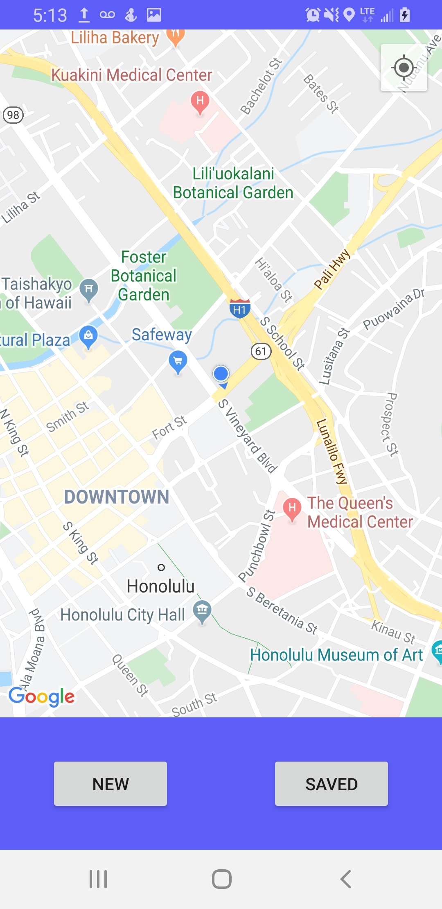

 I use google maps API to get user location and have the user select location of interest with a bubble that changes in size. Once the user comes within the user specified bubble, an alarm will trigger. Current version dosn't use location data from the API to search for places of interest.

[Google Maps Docs](https://developers.google.com/maps/documentation/javascript/tutorial), [Git Repository](https://github.com/derekasola/ProxAlarm2)

